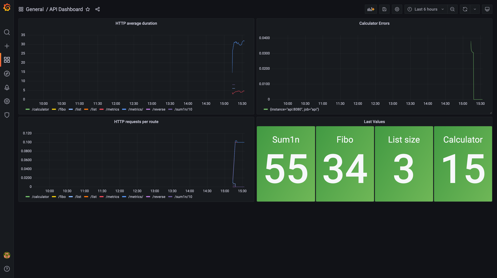

# prometheus-grafana

Это вторая часть проекта. В данном задании научимся настраивать связку Prometheus+Grafana и нарисуем графики.

### Полезное

- [Docker Image: Prometheus](https://hub.docker.com/r/prom/prometheus)
- [Docker Image: Grafana](https://hub.docker.com/r/grafana/grafana)
- [Мониторинг приложений с Prometheus](https://habr.com/ru/company/otus/blog/358588/)
- [Configure Prometheus to monitor the sample targets](https://prometheus.io/docs/prometheus/latest/getting_started/#configure-prometheus-to-monitor-the-sample-targets)
- [Grafana fundamentals](https://grafana.com/tutorials/grafana-fundamentals/?utm_source=grafana_gettingstarted)
- [Prometheus Query Functions](https://prometheus.io/docs/prometheus/latest/querying/functions/#rate)
- [Prometheus in Action](https://habr.com/ru/post/538692/)
- [Prometheus Simple Query Examples](https://prometheus.io/docs/prometheus/latest/querying/examples/)
- [Prometheus Histogram Visualization](https://prometheus.io/docs/practices/histograms/)
- [Overview of Grafana alerting](https://grafana.com/docs/grafana/latest/alerting/unified-alerting/)

### Задание

1. Пройти по ссылке задания в GitHub Classroom

   Задание выполняется в GitHub Classroom на ветке `monitoring`. После выполнения пришлите свою ссылку на рецензию ревьюеру в Stepik ([ССЫЛКА GITHUB CLASSROOM])
2. В Dockerfile для FastAPI установить максимальное кол-во воркеров (англ. "workers") на число `1`.

- Если использовали образ `tiangolo/uvicorn-gunicorn-fastapi` то установите env `MAX_WORKERS=1`;
- Если запускаете через `uvicorn`, то нужно запускать с флагом `--workers 1`;

3. Создать `docker-compose.yml`:

   - есть три сервиса `api`, `prometheus`, `grafana`;
   - cервис `api` собирает образ из текущей директории (директива "build"),
     в директории должет быть `Dockerfile`;
   - cервис `api` имеет порты - `8080:8080`;
   - cервис `api` рестартится при краше;
   - cервис `prometheus` использует образ `prom/prometheus:v2.34.0`;
   - cервис `prometheus` имеет порты - `9090:9090`;
   - cервис `prometheus` монтирует `prometheus.yml` внутрь контейнера.
     Определите куда нужно монтировать;
   - cервис `prometheus` зависит от `api`;
   - cервис `grafana` использует образ `grafana/grafana:8.4.5`;
   - cервис `grafana` имеет порты - `3000:3000`;
   - cервис `grafana` зависит от `prometheus`;

4. Создать `prometheus.yml`:

   - в `scrape_configs` есть `target` на сервис `api`. Настройте файл, так чтобы
     Prometheus собирал данные из экспортера `api` с интервалом 10 секунд;

5. Отправить запросы на каждый роут в API, чтобы появились метрики.
6. Добавить Prometheus Data Source в графане, чтобы извлекал данные из нашего запущенного прометеуса.
7. Создать дэшборд для сервиса `api` в графане с названием `API Dashboard`:

- создать панель с названием (англ. "title") `HTTP requests per route`, которая показывает среднюю
  скорость увеличения временного ряда в диапазоне 5 минут (см. "rate") по количеству запросов на каждый роут.
  В легендах показывать название роута.
- создать панель с названием `HTTP average duration`, которая показывает среднюю продолжительность времени
  выполнения запроса на каждый роут используя данные из гистограммы. В легендах показывать название роута.
- создать панель с названием `Last Values`, которая показывает последние значения ответов от роутов.
- создать панель с названием `Calculator Errors`, которая показывает rate за 5 минут по количеству ошибок
  в роуте calculator.

8. Настроить Alert в графане на то, что если кол-во ошибок в панеле `Calculator Errors` увеличивается
   то, нужно отправить оповещение в Telegram группу созданную специально под алерты. В сообщении с
   алертом должно быть указано, что кол-во ошибок в `/calculator` выросло.
9. Написать инструкцию как настроить Alert в графане в файл `ALERT.md`.
10. Экспортировать получившийся дэшборд с алертами в формате JSON и сохранить в репозитории под файлом `grafana-dashboard.json`.
11. Запушить в гит. Прислать ссылку на репозиторий на ветку `monitoring` и ссылку на телеграм группу для алертов.

Конечный дэшборд должен иметь следующий вид.



---

### Ответ
<<<<<<< HEAD
=======
```
>>>>>>> monitoring
from fastapi import FastAPI, Header
from fastapi.responses import JSONResponse
from pydantic import BaseModel
import prometheus_client
from prometheus_client import Counter, Histogram, Gauge

app = FastAPI()
metrics_app = prometheus_client.make_asgi_app()
app.mount("/metrics", metrics_app)

c = Counter('http_requests_total', 'Number of HTTP requests received')
h = Histogram('http_requests_milliseconds', 'Duration of HTTP requests in milliseconds')
gsum = Gauge('last_sum1n', 'Value stores last result of sum1n')
gfibo = Gauge('last_fibo', 'Value stores last result of fibo')
glistsize = Gauge('list_size', 'Value stores current list size')
gcalc = Gauge('last_calculator', 'Value stores last result of calculator')
ccalcerror = Counter('errors_calculator_total', 'Number of errors in calculator')

@app.get("/")
def read_root():
    return {"Hello": "World"}


@app.get("/sum1n/{n}")
async def read_root(n):
    n = int(n)
    c.inc()
    h.labels(route="/sum1n/{n}").observe(0.2)
    res = 0
    for i in range(n):
        res += i
    gsum.set(res)
    return {"result": res}


@app.get("/fibo/{n}")
async def fibnums(n):
    n = int(n)
    if n <= 0:
        gfibo.set(0)
        h.observe(0.2)
        h.labels(route="/fibo/{n}").observe(0.2)
    elif n == 1:
        gfibo.set(1)
        h.observe(0.2)
        return 0    
    elif n == 2:
        return 1
    else:
        a, b = 0, 1
        for _ in range (2, n):
            a, b = b, a + b
        gfibo.set(b)
        h.labels(route="/fibo/{n}").observe(0.2)
        return JSONResponse(content={"result": b})
    


@app.post("/reverse")
async def revers_word(string: str = Header(...)):
    return {"result": string[::-1]}


element_list = []
# Pydantic model
class ElementItem(BaseModel):
    element: str

@app.put("/list/")
async def create_item(item: ElementItem):
    element_list.append(item.element)
    return {"message": f"Item '{item.element}' updated successfully!"}

@app.get("/list/")
async def get_list():
    glistsize.set(len(element_list))
    h.labels(route="/list/").observe(0.2)
    return {"result": element_list}
    


class ElementItem(BaseModel):
    expr: str

@app.post("/calculator/")
async def calc(item: ElementItem):
    operands = item.expr.split(",")
    num1 = float(operands[0])  
    operator = operands[1]  
    num2 = float(operands[2])
    
    match operator:
        case "+":
            res = num1 + num2
        case "-":
            res = num1 - num2
        case "/":
            if num2 == 0:
                ccalcerror.inc()
                h.labels(route="/calculator/").observe(0.2)
                return "Division by zero is not allowed." 
            res = num1 / num2
        case "*":
            res = num1 * num2
    gcalc.set(res)
    h.labels(route="/calculator/").observe(0.2)
    return { "result": res } 